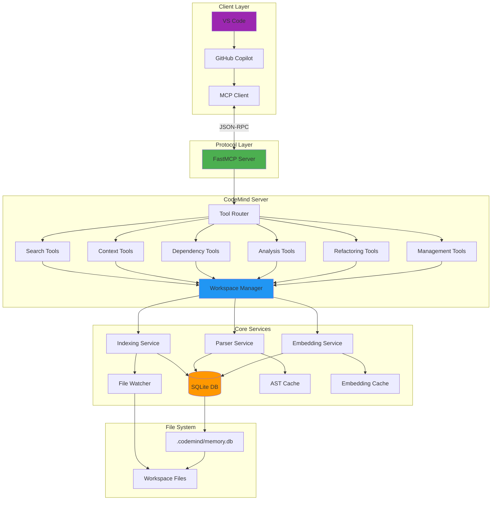
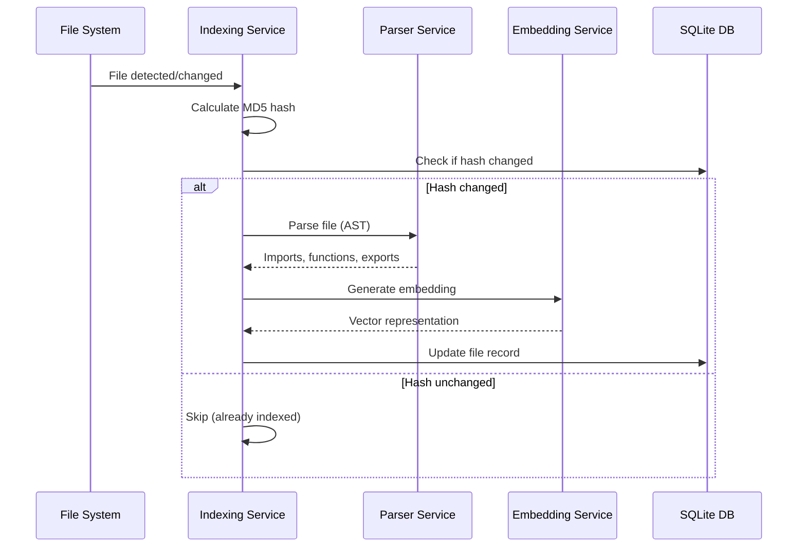
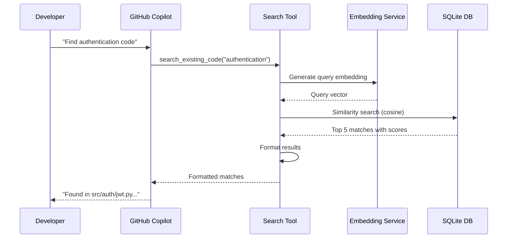
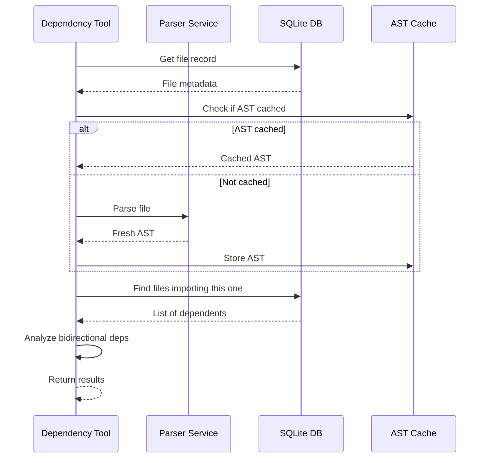
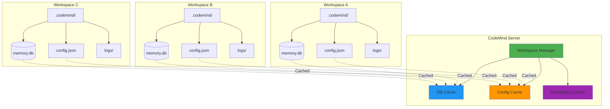
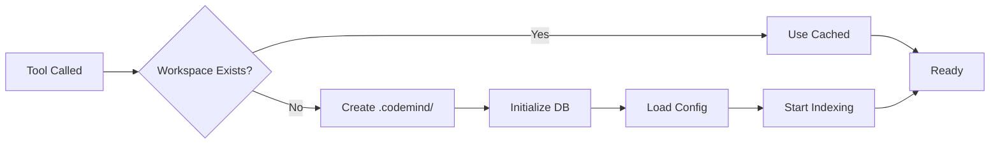
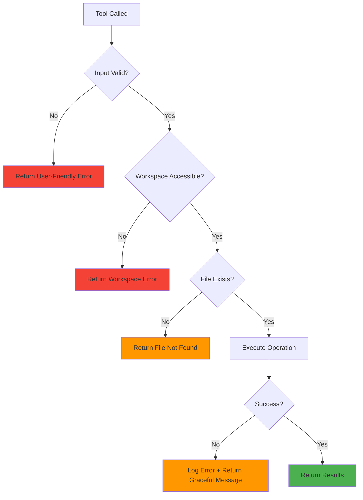
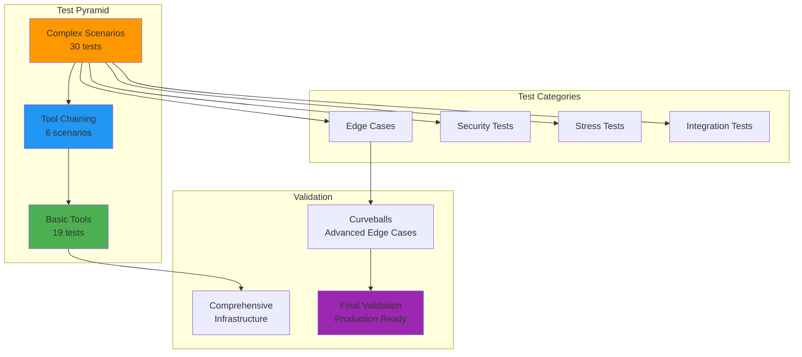

# Architecture Overview

Technical deep-dive into CodeMind's design and implementation.

---

## System Architecture



---

## Component Overview

### 1. Entry Point (`codemind.py`)
- **Purpose**: MCP server initialization and tool registration
- **Responsibilities**:
  - Configure logging
  - Suppress unnecessary output for clean MCP protocol
  - Register all 20 tools with FastMCP
  - Start server and handle connections
- **Key Features**:
  - Session logging to `.codemind/logs/`
  - UTF-8 encoding for Windows compatibility
  - Minimal stderr output (MCP protocol requirement)

### 2. Workspace Manager (`workspace.py`)
- **Purpose**: Multi-workspace isolation and resource management
- **Responsibilities**:
  - Maintain separate databases per workspace
  - Cache embedding models per workspace
  - Load workspace-specific configuration
  - Provide workspace-aware helpers
- **Key Features**:
  - Workspace hash-based isolation
  - Lazy initialization (only create DB when needed)
  - Configuration cascade (workspace > default)
  - Thread-safe resource caching

### 3. Parser Service (`parsers.py`)
- **Purpose**: AST-based code analysis for Python
- **Responsibilities**:
  - Extract imports (regular and from-imports)
  - Identify function definitions and calls
  - Extract docstrings and comments
  - Analyze exports (via `__all__` or public functions)
- **Key Features**:
  - Production-quality AST visitors
  - Handles malformed code gracefully
  - Caches parsed AST for performance
  - Type-safe return values

### 4. Indexing Service (`indexing.py`)
- **Purpose**: File scanning, change detection, and index updates
- **Responsibilities**:
  - Scan workspace for supported files
  - Hash-based change detection
  - Extract file purpose from docstrings
  - Generate semantic embeddings
- **Key Features**:
  - Incremental indexing (only changed files)
  - Configurable file size limits
  - Extension filtering
  - Background scanning support

### 5. Tool Modules (`tools/`)
- **Purpose**: Implement 20 MCP tools across 6 categories
- **Responsibilities**:
  - Expose MCP-compatible functions
  - Handle workspace_root parameter
  - Provide user-friendly output
  - Error handling and validation

---

## Data Flow

### Indexing Flow



### Search Flow



### Dependency Analysis Flow



---

## Database Schema

### Files Table
```sql
CREATE TABLE files (
    path TEXT PRIMARY KEY,              -- Relative file path
    purpose TEXT,                       -- What the file does
    last_scanned TIMESTAMP,            -- Last index time
    embedding BLOB,                    -- Numpy array (pickled)
    key_exports TEXT,                  -- JSON array of exports
    file_hash TEXT,                    -- MD5 hash for change detection
    size_kb INTEGER,                   -- File size
    imports TEXT,                      -- JSON array of imports
    functions TEXT                     -- JSON array of functions
);

CREATE INDEX idx_files_path ON files(path);
CREATE INDEX idx_files_last_scanned ON files(last_scanned);
```

### Decisions Table
```sql
CREATE TABLE decisions (
    id INTEGER PRIMARY KEY AUTOINCREMENT,
    description TEXT NOT NULL,         -- Brief description
    reasoning TEXT NOT NULL,           -- Detailed rationale
    timestamp TIMESTAMP DEFAULT CURRENT_TIMESTAMP,
    affected_files TEXT,               -- JSON array of file paths
    workspace_hash TEXT                -- For multi-workspace support
);

CREATE INDEX idx_decisions_timestamp ON decisions(timestamp DESC);
CREATE INDEX idx_decisions_workspace ON decisions(workspace_hash);
```

### Changes Table
```sql
CREATE TABLE changes (
    id INTEGER PRIMARY KEY AUTOINCREMENT,
    file_path TEXT NOT NULL,
    timestamp TIMESTAMP DEFAULT CURRENT_TIMESTAMP,
    change_summary TEXT,
    embedding BLOB,                    -- For semantic change search
    workspace_hash TEXT
);

CREATE INDEX idx_changes_file_path ON changes(file_path);
CREATE INDEX idx_changes_timestamp ON changes(timestamp DESC);
```

---

## Multi-Workspace Architecture



### Workspace Isolation Benefits

1. **No Cross-Contamination**: Each project has completely separate data
2. **Independent Configuration**: Per-workspace settings
3. **Concurrent Access**: Work with multiple projects simultaneously
4. **Resource Efficiency**: Shared embedding models when same configuration

### Workspace Hash Calculation
```python
def get_workspace_hash(workspace_path: str) -> str:
    """Generate unique hash for workspace path."""
    normalized = os.path.abspath(workspace_path)
    return hashlib.md5(normalized.encode()).hexdigest()[:8]
```

---

## Semantic Search Implementation

### Embedding Generation


### Similarity Search Algorithm

```python
def semantic_search(query: str, limit: int = 5) -> List[Match]:
    # 1. Generate query embedding
    query_vector = model.encode(query)
    
    # 2. Load all file embeddings from DB
    file_embeddings = db.get_all_embeddings()
    
    # 3. Calculate cosine similarity
    similarities = cosine_similarity(
        query_vector.reshape(1, -1),
        file_embeddings
    )[0]
    
    # 4. Get top-k matches
    top_indices = similarities.argsort()[-limit:][::-1]
    
    # 5. Return matches with scores
    return [
        Match(file=files[i], score=similarities[i])
        for i in top_indices
    ]
```

**Performance**:
- Query time: <500ms for 1000 files
- Memory: ~150KB per 1000 files (embeddings)
- Model: all-MiniLM-L6-v2 (384 dimensions)

---

## AST-Based Parsing

### Why AST Over Regex?

| Feature | AST | Regex |
|---------|-----|-------|
| **Accuracy** | ✅ 100% | ❌ ~80% |
| **Handles Edge Cases** | ✅ Yes | ❌ No |
| **Maintenance** | ✅ Easy | ❌ Hard |
| **Performance** | ✅ Fast (cached) | ✅ Fast |

### Import Extraction Example

```python
# Using AST (CodeMind approach)
import ast

class ImportVisitor(ast.NodeVisitor):
    def __init__(self):
        self.imports = []
    
    def visit_Import(self, node):
        for alias in node.names:
            self.imports.append(alias.name)
    
    def visit_ImportFrom(self, node):
        if node.module:
            self.imports.append(node.module)

# Handles ALL Python import syntax correctly
# - import foo
# - import foo as bar
# - from foo import bar
# - from foo import bar as baz
# - from . import foo
# - from ..foo import bar
```

**Benefits**:
- Handles all Python syntax variations
- Respects Python language rules
- Works with malformed code (syntax errors)
- Provides line numbers for context

---

## Performance Optimization

### 1. Lazy Workspace Initialization


### 2. Hash-Based Change Detection
```python
# Only reindex if file actually changed
new_hash = hashlib.md5(file_content).hexdigest()
old_hash = db.get_file_hash(file_path)

if new_hash != old_hash:
    reindex_file(file_path)
```

### 3. AST Caching
```python
# Cache parsed ASTs to avoid re-parsing
ast_cache: Dict[str, ast.Module] = {}

def get_ast(file_path: str) -> ast.Module:
    if file_path not in ast_cache:
        ast_cache[file_path] = ast.parse(file_content)
    return ast_cache[file_path]
```

### 4. Embedding Model Caching
```python
# Share embedding models across workspaces
model_cache: Dict[str, SentenceTransformer] = {}

def get_model(model_name: str) -> SentenceTransformer:
    if model_name not in model_cache:
        model_cache[model_name] = SentenceTransformer(model_name)
    return model_cache[model_name]
```

---

## Error Handling Strategy



### Error Handling Principles

1. **User-Friendly Messages**: No stack traces in tool output
2. **Graceful Degradation**: Partial results better than failures
3. **Detailed Logging**: Full errors logged to session files
4. **Input Validation**: Check parameters before processing

---

## Security Considerations

### 1. Path Traversal Prevention
```python
def validate_workspace_path(path: str) -> bool:
    """Ensure path doesn't escape workspace."""
    resolved = os.path.abspath(path)
    workspace = os.path.abspath(workspace_root)
    return resolved.startswith(workspace)
```

### 2. SQL Injection Prevention
```python
# Always use parameterized queries
cursor.execute(
    "SELECT * FROM files WHERE path = ?",
    (file_path,)
)
```

### 3. Configuration Validation
```python
def validate_config(config: dict) -> dict:
    """Validate and sanitize configuration."""
    return {
        "max_file_size_kb": min(config.get("max_file_size_kb", 500), 10000),
        "watched_extensions": [
            ext for ext in config.get("watched_extensions", [])
            if ext.startswith(".")
        ]
    }
```

---

## Testing Architecture



### Test Suite Organization

1. **test_01_basic.py** (19 tests)
   - Individual tool validation
   - Simple inputs, expected outputs
   - Fast execution (<5 seconds)

2. **test_02_chains.py** (6 scenarios)
   - Multi-tool workflows
   - Real-world usage patterns
   - Integration testing

3. **test_03_complex.py** (30 tests)
   - Edge cases (unicode, empty files, large files)
   - Security tests (SQL injection, path traversal)
   - Stress tests (bulk operations, large queries)

4. **test_comprehensive.py**
   - Infrastructure validation
   - Database integrity
   - Module imports

5. **test_curveballs.py** (35 tests)
   - Advanced edge cases
   - Unusual inputs
   - Error condition handling

6. **final_validation.py**
   - Production readiness check
   - Code quality metrics
   - Architecture validation

---

## Monitoring & Logging

### Session Logging
```
.codemind/logs/
├── session_20251006_103045.log
├── session_20251006_114523.log
└── session_20251006_152301.log
```

### Log Format
```
2025-10-06 10:30:45 - INFO - Session logging to: .codemind/logs/session_20251006_103045.log
2025-10-06 10:30:46 - INFO - All 20 CodeMind tools registered successfully
2025-10-06 10:30:46 - INFO - Server ready - waiting for MCP client connections...
2025-10-06 10:30:52 - INFO - Workspace initialized: d:\Projects\Python\CodeMind
2025-10-06 10:30:53 - INFO - Indexed 18 files in 0.8 seconds
2025-10-06 10:31:05 - INFO - search_existing_code: query='authentication' results=3
```

---

## Future Architecture Improvements

### Planned Enhancements

1. **Incremental AST Updates**
   - Only re-parse changed functions
   - Line-level change detection
   - Faster indexing for large files

2. **Distributed Indexing**
   - Multi-process file scanning
   - Parallel embedding generation
   - Scalable to 100k+ files

3. **Graph Database Integration**
   - Store call graphs natively
   - Faster dependency queries
   - Better circular dependency detection

4. **Plugin System**
   - Custom analyzers
   - Language-specific parsers
   - User-defined tools

5. **Team Collaboration**
   - Shared decision database
   - Team-wide code memory
   - Cloud sync support

---

## Technology Stack

| Component | Technology | Purpose |
|-----------|-----------|---------|
| **MCP Server** | FastMCP | Model Context Protocol implementation |
| **Database** | SQLite | Lightweight embedded database |
| **Embeddings** | sentence-transformers | Semantic code search |
| **AST Parsing** | Python `ast` module | Code structure analysis |
| **Code Metrics** | radon | Complexity and maintainability |
| **Git Integration** | GitPython | History and authorship tracking |
| **Type Checking** | mypy, Pylance | Type safety validation |

---

## Performance Benchmarks

| Operation | 100 Files | 1,000 Files | 10,000 Files |
|-----------|-----------|-------------|--------------|
| **Initial Scan** | 2s | 15s | 180s |
| **Incremental Index** | 0.1s | 0.5s | 3s |
| **Semantic Search** | 50ms | 300ms | 2s |
| **Dependency Analysis** | 10ms | 100ms | 500ms |
| **Import Graph** | 100ms | 1s | 8s |
| **Code Metrics** | 500ms | 3s | 25s |

**Test Environment**: Windows 11, Ryzen 5800X, 32GB RAM, NVMe SSD

---

For implementation details, see the source code in `codemind/` directory.
