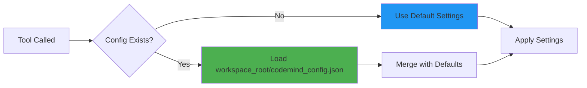

# Configuration Guide

Complete reference for configuring CodeMind.

---

## Default Configuration

CodeMind works out-of-the-box with sensible defaults. No configuration required for basic usage.

```python
# Default settings (automatic)
{
    "watched_extensions": [".py", ".js", ".ts", ".tsx", ".jsx", ".vue", 
                          ".java", ".cs", ".cpp", ".c", ".h", ".go", ".rs"],
    "max_file_size_kb": 500,
    "embedding_model": "all-MiniLM-L6-v2",
    "exclude_dirs": [".git", ".venv", "node_modules", "__pycache__"],
    "scan_interval": 300,
    "max_files": 10000,
    "lazy_scan": true,
    "enable_embeddings": true,
    "auto_index_on_change": true
}
```

---

## Custom Configuration

### Creating Configuration File

Create `codemind_config.json` in your project root:

```json
{
    "watched_extensions": [".py", ".js", ".ts"],
    "max_file_size_kb": 1000,
    "embedding_model": "all-MiniLM-L6-v2",
    "exclude_dirs": [".git", ".venv", "node_modules", "dist", "build"]
}
```

### Configuration Location



---

## Configuration Options

### File Watching

#### `watched_extensions`
**Type**: List of strings  
**Default**: `[".py", ".js", ".ts", ".tsx", ".jsx", ".vue", ".java", ".cs", ".cpp", ".c", ".h", ".go", ".rs"]`  
**Description**: File extensions to index

```json
{
    "watched_extensions": [".py", ".js", ".ts", ".tsx", ".jsx"]
}
```

**Tips**:
- Include the dot (`.py`, not `py`)
- Add custom extensions as needed
- Remove extensions to speed up indexing

---

#### `exclude_dirs`
**Type**: List of strings  
**Default**: `[".git", ".venv", "node_modules", "__pycache__"]`  
**Description**: Directories to ignore during scanning

```json
{
    "exclude_dirs": [
        ".git",
        ".venv",
        "node_modules",
        "dist",
        "build",
        "coverage",
        ".pytest_cache"
    ]
}
```

**Tips**:
- Always exclude `.git` (large and irrelevant)
- Exclude virtual environments
- Exclude build artifacts

---

#### `max_file_size_kb`
**Type**: Integer  
**Default**: `500`  
**Description**: Maximum file size to index (in KB)

```json
{
    "max_file_size_kb": 1000
}
```

**Tips**:
- Increase for projects with large files
- Decrease to save memory
- Files over limit are skipped

---

#### `max_files`
**Type**: Integer  
**Default**: `10000`  
**Description**: Maximum number of files to index

```json
{
    "max_files": 50000
}
```

**Tips**:
- Increase for large monorepos
- Decrease for faster indexing
- Performance degrades above 100k files

---

### Embeddings

#### `embedding_model`
**Type**: String  
**Default**: `"all-MiniLM-L6-v2"`  
**Description**: Sentence transformer model for semantic search

```json
{
    "embedding_model": "all-MiniLM-L6-v2"
}
```

**Available Models**:

| Model | Dimensions | Speed | Quality | Use Case |
|-------|-----------|-------|---------|----------|
| `all-MiniLM-L6-v2` | 384 | ⚡⚡⚡ | ⭐⭐⭐ | **Default** - Best balance |
| `all-mpnet-base-v2` | 768 | ⚡⚡ | ⭐⭐⭐⭐ | Higher quality |
| `paraphrase-MiniLM-L3-v2` | 384 | ⚡⚡⚡⚡ | ⭐⭐ | Fastest |
| `multi-qa-MiniLM-L6-cos-v1` | 384 | ⚡⚡⚡ | ⭐⭐⭐ | Q&A optimized |

**Tips**:
- Smaller = faster, larger = better quality
- Model downloads on first use (~90MB)
- Models are cached per workspace

---

#### `enable_embeddings`
**Type**: Boolean  
**Default**: `true`  
**Description**: Enable/disable semantic search embeddings

```json
{
    "enable_embeddings": false
}
```

**Tips**:
- Disable to save memory (~150KB per 1000 files)
- Search tools won't work without embeddings
- Useful for testing or limited resources

---

### Indexing Behavior

#### `lazy_scan`
**Type**: Boolean  
**Default**: `true`  
**Description**: Only index workspace when first tool is called

```json
{
    "lazy_scan": false
}
```

**Tips**:
- `true`: Faster startup, index on demand
- `false`: Index immediately on server start
- Recommended: `true` for development

---

#### `scan_interval`
**Type**: Integer  
**Default**: `300`  
**Description**: Seconds between automatic full rescans

```json
{
    "scan_interval": 600
}
```

**Tips**:
- Increase to reduce CPU usage
- Decrease for real-time updates
- Set to `0` to disable automatic rescans

---

#### `auto_index_on_change`
**Type**: Boolean  
**Default**: `true`  
**Description**: Automatically reindex files when they change

```json
{
    "auto_index_on_change": false
}
```

**Tips**:
- `true`: Real-time updates (recommended)
- `false`: Manual indexing only
- Uses file hash for change detection

---

## Multi-Workspace Configuration

Each workspace can have its own configuration:

```
Project A/
  codemind_config.json    # Config for Project A
  .codemind/
    memory.db

Project B/
  codemind_config.json    # Config for Project B (different settings)
  .codemind/
    memory.db

Project C/
  # No config - uses defaults
  .codemind/
    memory.db
```

**Benefits**:
- Per-project customization
- Different languages = different extensions
- Isolated settings

---

## Environment Variables

Override configuration via environment variables:

```bash
# Windows PowerShell
$env:CODEMIND_MAX_FILE_SIZE="1000"
$env:CODEMIND_EMBEDDING_MODEL="all-mpnet-base-v2"

# Linux/Mac
export CODEMIND_MAX_FILE_SIZE=1000
export CODEMIND_EMBEDDING_MODEL=all-mpnet-base-v2
```

**Available Variables**:
- `CODEMIND_MAX_FILE_SIZE`: Max file size in KB
- `CODEMIND_EMBEDDING_MODEL`: Model name
- `CODEMIND_SCAN_INTERVAL`: Scan interval in seconds
- `CODEMIND_LAZY_SCAN`: "true" or "false"

**Priority**: Environment > Config File > Defaults

---

## Configuration Examples

### Python-Only Project

```json
{
    "watched_extensions": [".py"],
    "exclude_dirs": [".git", ".venv", "__pycache__", ".pytest_cache"],
    "max_file_size_kb": 500,
    "embedding_model": "all-MiniLM-L6-v2"
}
```

---

### Full-Stack JavaScript Project

```json
{
    "watched_extensions": [".js", ".jsx", ".ts", ".tsx", ".vue"],
    "exclude_dirs": [".git", "node_modules", "dist", "build", "coverage"],
    "max_file_size_kb": 300,
    "embedding_model": "paraphrase-MiniLM-L3-v2"
}
```

---

### Large Monorepo

```json
{
    "watched_extensions": [".py", ".js", ".ts", ".java", ".go"],
    "exclude_dirs": [
        ".git",
        "node_modules",
        "vendor",
        "target",
        ".venv",
        "dist"
    ],
    "max_file_size_kb": 1000,
    "max_files": 50000,
    "embedding_model": "all-MiniLM-L6-v2",
    "scan_interval": 600,
    "lazy_scan": true
}
```

---

### Resource-Constrained Environment

```json
{
    "watched_extensions": [".py"],
    "exclude_dirs": [".git", ".venv"],
    "max_file_size_kb": 200,
    "max_files": 1000,
    "embedding_model": "paraphrase-MiniLM-L3-v2",
    "scan_interval": 0,
    "enable_embeddings": true,
    "lazy_scan": true
}
```

---

### High-Quality Search

```json
{
    "watched_extensions": [".py", ".js", ".ts"],
    "max_file_size_kb": 1000,
    "embedding_model": "all-mpnet-base-v2",
    "enable_embeddings": true,
    "auto_index_on_change": true
}
```

---

## Performance Tuning

### For Speed

```json
{
    "embedding_model": "paraphrase-MiniLM-L3-v2",
    "max_file_size_kb": 300,
    "max_files": 5000,
    "scan_interval": 0,
    "watched_extensions": [".py"]
}
```

**Results**:
- Faster indexing (~2x speed)
- Lower memory usage
- Slightly lower search quality

---

### For Quality

```json
{
    "embedding_model": "all-mpnet-base-v2",
    "max_file_size_kb": 2000,
    "max_files": 100000,
    "auto_index_on_change": true
}
```

**Results**:
- Best search accuracy
- Higher memory usage (~300MB for 10k files)
- Slower indexing (~20% slower)

---

### For Large Codebases

```json
{
    "max_files": 100000,
    "max_file_size_kb": 1000,
    "embedding_model": "all-MiniLM-L6-v2",
    "lazy_scan": true,
    "scan_interval": 900
}
```

**Results**:
- Handles 100k+ files
- Reasonable performance
- Gradual memory growth

---

## Configuration Validation

CodeMind validates configuration on load:

```python
def validate_config(config: dict) -> dict:
    """Validate and sanitize configuration."""
    validated = {}
    
    # Ensure positive integers
    validated["max_file_size_kb"] = max(1, min(config.get("max_file_size_kb", 500), 10000))
    validated["max_files"] = max(1, min(config.get("max_files", 10000), 1000000))
    validated["scan_interval"] = max(0, config.get("scan_interval", 300))
    
    # Ensure valid extensions
    validated["watched_extensions"] = [
        ext for ext in config.get("watched_extensions", DEFAULT_EXTENSIONS)
        if ext.startswith(".")
    ]
    
    # Ensure valid model
    valid_models = ["all-MiniLM-L6-v2", "all-mpnet-base-v2", ...]
    model = config.get("embedding_model", "all-MiniLM-L6-v2")
    validated["embedding_model"] = model if model in valid_models else "all-MiniLM-L6-v2"
    
    return validated
```

**Errors are logged but don't crash the server**.

---

## Troubleshooting Configuration

### Config Not Loading

**Symptom**: Custom settings not applied

**Solutions**:
1. Check file name: `codemind_config.json` (exact)
2. Check file location: Project root (where `.codemind/` is created)
3. Validate JSON syntax: Use JSON validator
4. Check logs: `.codemind/logs/session_*.log`

---

### Slow Indexing

**Symptom**: Initial scan takes too long

**Solutions**:
```json
{
    "max_file_size_kb": 300,
    "max_files": 5000,
    "watched_extensions": [".py"],
    "exclude_dirs": [".git", ".venv", "node_modules", "dist"]
}
```

---

### High Memory Usage

**Symptom**: CodeMind uses too much RAM

**Solutions**:
```json
{
    "max_files": 5000,
    "embedding_model": "paraphrase-MiniLM-L3-v2",
    "max_file_size_kb": 200
}
```

---

### Poor Search Results

**Symptom**: Semantic search doesn't find relevant files

**Solutions**:
```json
{
    "embedding_model": "all-mpnet-base-v2",
    "enable_embeddings": true,
    "auto_index_on_change": true
}
```

---

## Configuration Schema

```typescript
interface CodeMindConfig {
    // File watching
    watched_extensions?: string[];        // [".py", ".js", ...]
    exclude_dirs?: string[];             // [".git", ".venv", ...]
    max_file_size_kb?: number;           // 500
    max_files?: number;                  // 10000
    
    // Embeddings
    embedding_model?: string;            // "all-MiniLM-L6-v2"
    enable_embeddings?: boolean;         // true
    
    // Indexing
    lazy_scan?: boolean;                 // true
    scan_interval?: number;              // 300 (seconds)
    auto_index_on_change?: boolean;      // true
}
```

---

## Best Practices

### 1. Start with Defaults
```json
{}  // Empty config = use defaults
```

### 2. Customize Gradually
```json
{
    "watched_extensions": [".py"]  // Add one setting at a time
}
```

### 3. Test Configuration
```bash
# Force reindex to test settings
python -c "from codemind.tools import force_reindex; force_reindex()"
```

### 4. Monitor Performance
Check logs:
```bash
# View latest session log
cat .codemind/logs/session_*.log
```

### 5. Version Control
```bash
# Add to .gitignore
echo ".codemind/" >> .gitignore
echo "codemind_config.json" >> .gitignore  # If project-specific
```

---

For more details, see **[Architecture Guide](ARCHITECTURE.md)**.
