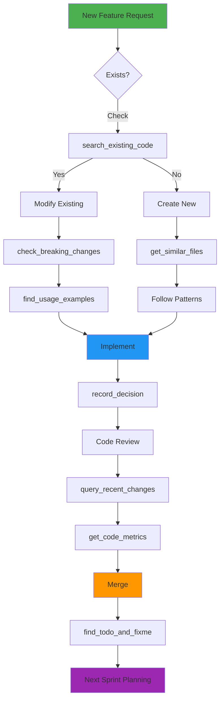

# Real-World Examples

Practical examples of using CodeMind with GitHub Copilot.

---

## Example 1: Avoiding Duplicate Files

### Scenario
You want to add JWT authentication to your project.

### Without CodeMind
```
💬 Developer: "Add JWT authentication"
🤖 Copilot: *Creates auth/jwt_handler.py*
🤖 Copilot: *Creates middleware/auth.py*
🤖 Copilot: *Creates utils/token.py*
😫 Developer: "Wait, we already have auth code somewhere..."
```

### With CodeMind
```
💬 Developer: "Add JWT authentication"
🤖 Copilot: search_existing_code("JWT authentication")
🧠 CodeMind: "Found: src/auth/jwt.py (95% match) - JWT token generation and validation"
🤖 Copilot: "I found existing JWT auth in src/auth/jwt.py. Should I modify it to add the features you need?"
😊 Developer: "Perfect! Yes, add refresh token support"
```

**Tools Used**:
- `search_existing_code`
- `get_file_context`
- `find_usage_examples`

---

## Example 2: Safe Refactoring

### Scenario
You need to rename a widely-used function.

### Without CodeMind
```
💬 Developer: "Rename authenticate_user to verify_user"
🤖 Copilot: *Renames function in auth.py*
💥 Runtime Error: "authenticate_user is not defined"
😫 Developer: "Oops, forgot about the other files using it..."
```

### With CodeMind
```
💬 Developer: "Rename authenticate_user to verify_user"
🤖 Copilot: check_breaking_changes("authenticate_user", "auth.py")
🧠 CodeMind: "⚠️ This will affect 7 files: api/users.py, api/posts.py, middleware/auth.py..."
🤖 Copilot: "This function is used in 7 files. I'll update all of them. Here's the plan..."
😊 Developer: "Great, proceed"
```

**Tools Used**:
- `check_breaking_changes`
- `find_usage_examples`
- `get_test_coverage`

---

## Example 3: Understanding Code Relationships

### Scenario
You're new to the codebase and need to understand how modules relate.

### Without CodeMind
```
💬 Developer: "What files depend on database.py?"
🤖 Copilot: "Let me search for imports..." *searches manually*
🤖 Copilot: "I found some imports in models/user.py and models/post.py"
😐 Developer: "Are there more? I'm not sure this is complete..."
```

### With CodeMind
```
💬 Developer: "What files depend on database.py?"
🤖 Copilot: find_dependencies("src/database.py")
🧠 CodeMind: "database.py is imported by: models/user.py, models/post.py, auth/session.py, tests/test_db.py"
🤖 Copilot: "Here's the complete dependency tree. The database.py module has 4 dependents. Should I show the import graph?"
😊 Developer: "Yes, show the full graph"
🤖 Copilot: get_import_graph()
🧠 CodeMind: *Shows full project import structure with circular dependency warnings*
```

**Tools Used**:
- `find_dependencies`
- `get_import_graph`
- `get_call_tree`

---

## Example 4: Tracking Decisions

### Scenario
Team member asks why you chose a specific approach.

### Without CodeMind
```
💬 Developer: "Why did we choose Redis over Memcached?"
🤖 Copilot: "I don't have context about past decisions..."
😫 Developer: *Searches Slack, emails, old PRs...*
```

### With CodeMind
```
💬 Developer: "Why did we choose Redis over Memcached?"
🤖 Copilot: list_all_decisions(keyword="Redis")
🧠 CodeMind: "Decision #15 (2025-09-20): Chose Redis over Memcached. Reasoning: Redis provides persistence and pub/sub features needed for real-time notifications. Affected files: cache/redis.py, config/cache.json"
🤖 Copilot: "Found the decision! We chose Redis because..."
😊 Developer: "Perfect, thanks!"
```

**Tools Used**:
- `list_all_decisions`
- `query_recent_changes`

---

## Example 5: Code Review Preparation

### Scenario
Preparing for a code review of recent changes.

### Workflow


### Commands
```
💬 "What changed in the last 48 hours?"
→ query_recent_changes(hours=48)

💬 "Get context for auth/jwt.py"
→ get_file_context("auth/jwt.py")

💬 "Will this change break anything?"
→ check_breaking_changes("JWTHandler", "auth/jwt.py")

💬 "Show all FIXMEs in the changed files"
→ find_todo_and_fixme(tag_type="FIXME")

💬 "Overall code quality metrics"
→ get_code_metrics_summary(detailed=True)
```

**Tools Used**:
- `query_recent_changes`
- `get_file_context`
- `check_breaking_changes`
- `find_todo_and_fixme`
- `get_code_metrics_summary`

---

## Example 6: Finding Similar Patterns

### Scenario
You need to write a new test file and want to follow existing conventions.

### Without CodeMind
```
💬 Developer: "How do we structure test files?"
🤖 Copilot: *Shows generic test template*
😐 Developer: "But what's the project-specific pattern?"
```

### With CodeMind
```
💬 Developer: "Show me test files similar to the one I need to create"
🤖 Copilot: get_similar_files("tests/test_user.py")
🧠 CodeMind: "Similar files:
  1. tests/test_post.py (78% similar) - Test suite for post model
  2. tests/test_comment.py (65% similar) - Test suite for comments"
🤖 Copilot: "Here are similar test files in your project. I'll follow the same pattern..."
😊 Developer: "Perfect, use that structure"
```

**Tools Used**:
- `get_similar_files`
- `get_file_context`
- `find_usage_examples`

---

## Example 7: Security Audit

### Scenario
Checking for security issues before deployment.

### Commands
```
💬 "Find all configuration files"
→ find_configuration_inconsistencies()

Result:
⚠️ HARDCODED SECRETS:
  - config/dev.json:12 - API_KEY = "sk_live_abc123..."
  - src/utils/api.py:45 - SECRET_KEY = "hardcoded_secret"

⚠️ SECURITY RISKS:
  - DEBUG=true in prod.json (should be false)
  - ALLOWED_HOSTS=['*'] too permissive

💬 "Check for SQL injection vulnerabilities"
→ search_existing_code("SQL query string concatenation")

💬 "Find all TODOs related to security"
→ find_todo_and_fixme(search_term="security")
```

**Tools Used**:
- `find_configuration_inconsistencies`
- `search_existing_code`
- `find_todo_and_fixme`

---

## Example 8: Understanding Complex Call Chains

### Scenario
Debugging a performance issue in a function.

### Without CodeMind
```
💬 Developer: "What calls process_payment?"
🤖 Copilot: *Manual code search*
😫 Developer: "And what does process_payment call? This is tedious..."
```

### With CodeMind
```
💬 Developer: "Show me the call tree for process_payment"
🤖 Copilot: get_call_tree("process_payment", depth=3)
🧠 CodeMind: 
  CALLS (what it calls):
  ├─ validate_payment()
  │  └─ check_fraud()
  │     └─ query_fraud_database()
  └─ charge_card()
     └─ stripe_api.charge()
  
  CALLED BY (who calls it):
  ├─ checkout_endpoint()
  └─ subscription_renewal()

🤖 Copilot: "Here's the full call chain. The performance issue is likely in query_fraud_database() based on the depth..."
😊 Developer: "Excellent analysis!"
```

**Tools Used**:
- `get_call_tree`
- `find_usage_examples`
- `get_file_history_summary`

---

## Example 9: Multi-Workspace Development

### Scenario
Working on a microservices architecture with multiple projects.

### Commands
```
💬 "Search for authentication in the API service"
→ search_existing_code("authentication", workspace_root="/projects/api-service")

💬 "Search for authentication in the frontend"
→ search_existing_code("authentication", workspace_root="/projects/frontend")

💬 "Compare auth approaches across services"
→ get_file_context("auth/jwt.py", workspace_root="/projects/api-service")
→ get_file_context("auth/auth.ts", workspace_root="/projects/frontend")

💬 "Record architectural decision for API service only"
→ record_decision(
    description="Using OAuth2 for third-party auth",
    reasoning="Better security and user experience",
    workspace_root="/projects/api-service"
  )
```

**Benefits**:
- No cross-contamination between projects
- Each service maintains its own context
- Work with multiple codebases simultaneously

---

## Example 10: Technical Debt Management

### Scenario
Planning a sprint to address technical debt.

### Workflow
```
💬 "Show all TODO comments"
→ find_todo_and_fixme(tag_type="TODO")

💬 "Show all FIXME comments"
→ find_todo_and_fixme(tag_type="FIXME")

💬 "Show all HACK comments"
→ find_todo_and_fixme(tag_type="HACK")

💬 "Get code quality metrics"
→ get_code_metrics_summary(detailed=True)

💬 "Find circular dependencies"
→ get_import_graph()

💬 "Check configuration inconsistencies"
→ find_configuration_inconsistencies()
```

**Output Summary**:
```
TECHNICAL DEBT INVENTORY:
- 45 TODO comments (feature requests)
- 12 FIXME comments (bugs to fix)
- 8 HACK comments (workarounds to improve)
- 2 circular dependencies detected
- 5 functions with high complexity (>10)
- 3 hardcoded secrets to move to env vars

PRIORITY RECOMMENDATIONS:
1. Fix circular dependencies (architecture issue)
2. Address 12 FIXME comments (known bugs)
3. Refactor 5 high-complexity functions
4. Move hardcoded secrets to environment
5. Address HACK workarounds
```

---

## Example 11: Onboarding New Developers

### Scenario
New team member needs to understand the codebase.

### Onboarding Commands
```
💬 "Give me an overview of the project structure"
→ get_code_metrics_summary(detailed=False)

💬 "What are the main modules?"
→ get_import_graph(include_external=False)

💬 "Show me architectural decisions"
→ list_all_decisions(limit=20)

💬 "What are common patterns for API endpoints?"
→ get_similar_files("api/users.py")
→ find_usage_examples("create_endpoint")

💬 "Show recent activity"
→ query_recent_changes(hours=168)  # Last week

💬 "What needs work?"
→ find_todo_and_fixme(tag_type="TODO")
```

**Result**: New developer has comprehensive understanding in minutes, not days.

---

## Example 12: Deployment Checklist

### Pre-Deployment Commands
```
💬 "Check configuration consistency"
→ find_configuration_inconsistencies()

💬 "Verify no debug flags in production"
→ search_existing_code("DEBUG = True")

💬 "Check for hardcoded secrets"
→ find_configuration_inconsistencies(include_examples=False)

💬 "Find all FIXMEs blocking deployment"
→ find_todo_and_fixme(tag_type="FIXME", search_term="blocker")

💬 "Get overall code quality"
→ get_code_metrics_summary()

💬 "Check test coverage of critical files"
→ get_test_coverage("api/payment.py")
→ get_test_coverage("auth/jwt.py")
```

---

## Best Practices

### 1. Before Creating Files
Always search first:
```
search_existing_code("what I need")
check_functionality_exists("feature")
```

### 2. Before Refactoring
Always check impact:
```
check_breaking_changes("function_name", "file.py")
find_usage_examples("function_name")
get_test_coverage("file.py")
```

### 3. During Development
Track your decisions:
```
record_decision(
    description="What you decided",
    reasoning="Why you decided it",
    affected_files=["list", "of", "files"]
)
```

### 4. Before Code Review
Prepare thoroughly:
```
query_recent_changes(hours=48)
get_code_metrics_summary(detailed=True)
find_todo_and_fixme(tag_type="FIXME")
```

### 5. For Architecture Understanding
Visualize relationships:
```
get_import_graph()
find_dependencies("critical_file.py")
get_call_tree("important_function")
```

---

## Integration with Development Workflow



---

## Common Copilot Chat Prompts

### Discovery
- "Does this project have [feature]?"
- "Where is [functionality] implemented?"
- "Show me files similar to [filename]"
- "Find examples of [pattern]"

### Understanding
- "What does [filename] do?"
- "What depends on [filename]?"
- "Show me the call tree for [function]"
- "What changed recently?"

### Safety
- "What will break if I change [function]?"
- "Show me how [function] is used"
- "What's the test coverage for [file]?"

### Quality
- "Show me technical debt"
- "Find all TODO comments"
- "Check code quality metrics"
- "Find configuration issues"

### Decision Making
- "Why did we choose [approach]?"
- "What decisions affected [file]?"
- "Record this architectural decision"

---

For more details on specific tools, see **[Tool Reference](TOOLS.md)**.
