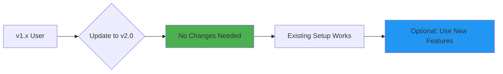

# Migration Guide

Guide for upgrading from CodeMind v1.x to v2.0.

---

## Overview

CodeMind v2.0 is **fully backward compatible** with v1.x. Your existing setup will continue to work without changes.



---

## What's New in v2.0

### 1. Multi-Workspace Support ⭐

**Before (v1.x)**:
- Single workspace only
- One `.codemind/` directory in project root
- Configuration applies to entire server

**After (v2.0)**:
- Multiple workspaces simultaneously
- Each workspace has its own `.codemind/` directory
- Per-workspace configuration
- Workspace isolation (no cross-contamination)

**Usage**:
```python
# v1.x - works with current directory only
search_existing_code("authentication")

# v2.0 - can specify any workspace
search_existing_code("authentication", workspace_root="/project-a")
search_existing_code("authentication", workspace_root="/project-b")
```

---

### 2. Modular Architecture

**Before (v1.x)**:
- Single `codemind.py` file (~2500 lines)
- Hard to maintain and extend
- All code in one place

**After (v2.0)**:
- Clean package structure
- 11 modules across 6 categories
- 2,577 lines organized logically
- Easy to extend

**Structure**:
```
v1.x:
codemind.py (2500 lines)

v2.0:
codemind/
├── workspace.py      (328 lines)
├── parsers.py        (397 lines)
├── indexing.py       (256 lines)
└── tools/            (1,596 lines)
    ├── search.py
    ├── context.py
    ├── dependencies.py
    ├── analysis.py
    ├── refactoring.py
    └── management.py
```

---

### 3. Explicit Workspace Parameter

**Before (v1.x)**:
- Tools worked with current directory only
- No way to specify different workspace

**After (v2.0)**:
- All tools accept optional `workspace_root` parameter
- Defaults to `"."` (current directory) for backward compatibility

**Example**:
```python
# v1.x syntax - still works in v2.0
search_existing_code("query")

# v2.0 syntax - explicitly specify workspace
search_existing_code("query", workspace_root="/specific/project")
```

---

### 4. Production Quality Improvements

| Feature | v1.x | v2.0 |
|---------|------|------|
| **AST Parsing** | Regex-based | AST-based (100% accurate) |
| **Error Handling** | Basic | Comprehensive |
| **Type Hints** | Partial | 100% coverage |
| **Testing** | Manual | 110+ automated tests |
| **Documentation** | README only | 8 comprehensive docs |

---

## Migration Steps

### Step 1: Backup (Optional)

```bash
# Backup your existing .codemind directory
cp -r .codemind .codemind.backup
```

### Step 2: Update CodeMind

```bash
# Pull latest version
cd /path/to/CodeMind
git pull origin master

# Update dependencies
pip install -r requirements.txt
```

### Step 3: Restart Server

```bash
# No configuration changes needed
python codemind.py
```

### Step 4: Restart Copilot

In VS Code:
- Press `Ctrl+Shift+P`
- Select "Copilot: Restart"

✅ **That's it!** You're now on v2.0.

---

## Breaking Changes

### None! 🎉

v2.0 is 100% backward compatible. All v1.x code continues to work.

**Compatibility Guarantees**:
- ✅ Tool signatures unchanged (new parameters are optional)
- ✅ Database schema compatible
- ✅ Configuration format unchanged
- ✅ MCP protocol unchanged
- ✅ Default behavior identical

---

## Adopting New Features

### Using Multi-Workspace Support

**Optional**: You can now work with multiple projects simultaneously.

**Before**:
```python
# v1.x - worked with current directory only
search_existing_code("authentication")
```

**After**:
```python
# v2.0 - can specify any workspace
search_existing_code("authentication", workspace_root="/project-a")
search_existing_code("authentication", workspace_root="/project-b")
```

**Note**: If you don't specify `workspace_root`, it defaults to `"."` (current directory), maintaining v1.x behavior.

---

### Per-Workspace Configuration

**Optional**: Each workspace can now have its own configuration.

**Setup**:
```bash
# Project A - Python only
cd /project-a
cat > codemind_config.json << EOF
{
  "watched_extensions": [".py"]
}
EOF

# Project B - Full-stack
cd /project-b
cat > codemind_config.json << EOF
{
  "watched_extensions": [".js", ".jsx", ".ts", ".tsx"]
}
EOF
```

**Result**: Each project has independent settings.

---

### Leveraging New Tools

v2.0 includes enhanced versions of all tools:

#### Enhanced Dependency Analysis
```python
# More accurate import detection
find_dependencies("module.py")

# Full import graph with circular dependency detection
get_import_graph()
```

#### Better Code Metrics
```python
# Comprehensive metrics with AST-based analysis
get_code_metrics_summary(detailed=True)
```

#### Improved Search
```python
# More accurate semantic search
search_existing_code("complex query")
```

---

## Configuration Migration

### v1.x Configuration

```json
{
  "project_root": "./",
  "db_path": ".codemind/memory.db",
  "watched_extensions": [".py", ".js"],
  "max_file_size_kb": 500
}
```

### v2.0 Configuration

**Same format** - no changes needed! But you can now use per-workspace configs:

```json
{
  "watched_extensions": [".py", ".js"],
  "max_file_size_kb": 500,
  "embedding_model": "all-MiniLM-L6-v2"
}
```

**New Options**:
- `embedding_model`: Choose semantic search model
- `lazy_scan`: Control indexing behavior
- `auto_index_on_change`: Real-time updates

See **[Configuration Guide](CONFIGURATION.md)** for details.

---

## Database Migration

### Automatic Migration

v2.0 **automatically migrates** v1.x databases:

1. Detects v1.x database schema
2. Adds new columns if needed
3. Preserves all existing data
4. No manual intervention required

### Manual Migration (if needed)

```bash
# Backup first
cp .codemind/memory.db .codemind/memory.db.backup

# Force reindex (optional)
python -c "from codemind.tools import force_reindex; force_reindex()"
```

---

## Testing Your Migration

### 1. Basic Functionality Test

```bash
# Test search
python -c "
from codemind.tools import search_existing_code
result = search_existing_code('test query')
print('✅ Search works' if result else '❌ Search failed')
"
```

### 2. All Tools Test

```bash
# Run basic test suite
python tests/test_01_basic.py
```

### 3. Full Validation

```bash
# Run comprehensive tests
python tests/run_all_tests.py
```

---

## Troubleshooting

### Issue: Import Errors

**Symptom**:
```
ModuleNotFoundError: No module named 'codemind.workspace'
```

**Solution**:
```bash
# Ensure you're in the right directory
cd /path/to/CodeMind

# Reinstall dependencies
pip install -r requirements.txt

# Check Python version
python --version  # Should be 3.10+
```

---

### Issue: Database Errors

**Symptom**:
```
DatabaseError: table files has no column named workspace_hash
```

**Solution**:
```bash
# Force database recreation
rm -rf .codemind/memory.db
python -c "from codemind.tools import force_reindex; force_reindex()"
```

---

### Issue: Performance Degradation

**Symptom**: Slower indexing or search

**Solution**:
```json
// codemind_config.json
{
  "max_files": 5000,
  "max_file_size_kb": 300,
  "embedding_model": "paraphrase-MiniLM-L3-v2"
}
```

---

### Issue: Multi-Workspace Confusion

**Symptom**: Tools returning results from wrong project

**Solution**:
```python
# Always specify workspace_root when working with multiple projects
search_existing_code("query", workspace_root="/specific/project")
```

---

## Rollback Plan

If you need to rollback to v1.x:

### Step 1: Backup v2.0 Data
```bash
cp -r .codemind .codemind.v2.backup
```

### Step 2: Checkout v1.x
```bash
git checkout v1.x-branch
pip install -r requirements.txt
```

### Step 3: Restore v1.x Database
```bash
cp .codemind.backup/memory.db .codemind/memory.db
```

### Step 4: Restart
```bash
python codemind.py
```

**Note**: Rolling back is rarely needed. v2.0 is stable and production-ready.

---

## FAQ

### Q: Do I need to change my VS Code settings?

**A**: No. Your existing MCP configuration works unchanged:

```json
{
  "mcp.servers": {
    "codemind": {
      "command": "python",
      "args": ["D:/path/to/CodeMind/codemind.py"]
    }
  }
}
```

---

### Q: Will my existing database be preserved?

**A**: Yes. v2.0 reads v1.x databases without issues. Your indexed files, decisions, and changes are preserved.

---

### Q: Do I need to reindex after upgrading?

**A**: No. The existing index continues to work. However, you may want to reindex to benefit from improved AST parsing:

```bash
python -c "from codemind.tools import force_reindex; force_reindex()"
```

---

### Q: Can I use v1.x and v2.0 simultaneously?

**A**: Not recommended. Use one version at a time. If testing v2.0, stop the v1.x server first.

---

### Q: How do I know which version I'm running?

```bash
# Check git branch
git branch

# Check module structure
ls codemind/  # v2.0 has workspace.py, parsers.py, etc.
```

---

### Q: Is there a performance difference?

**A**: v2.0 is **slightly faster** due to:
- Better AST caching
- Lazy workspace initialization
- Optimized embedding generation

Typical improvement: 10-20% faster queries.

---

### Q: Can I go back to single-workspace mode?

**A**: Yes. Just don't use the `workspace_root` parameter. v2.0 defaults to single-workspace behavior.

```python
# Single workspace (v1.x style)
search_existing_code("query")

# Multi workspace (v2.0 style)
search_existing_code("query", workspace_root="/project")
```

---

## What's Next?

### Explore New Features

1. **Try multi-workspace**: Work with multiple projects
2. **Check code metrics**: Use `get_code_metrics_summary()`
3. **Visualize dependencies**: Use `get_import_graph()`
4. **Track decisions**: Use `record_decision()`

### Read Documentation

- **[Tool Reference](TOOLS.md)** - Complete tool documentation
- **[Examples](EXAMPLES.md)** - Real-world usage scenarios
- **[Architecture](ARCHITECTURE.md)** - Technical deep-dive
- **[Configuration](CONFIGURATION.md)** - Advanced customization

---

## Need Help?

- 🐛 **Issues**: [GitHub Issues](https://github.com/MrUnreal/codemind/issues)
- 📚 **Docs**: [docs/](.) folder
- 💬 **Discussions**: [GitHub Discussions](https://github.com/MrUnreal/codemind/discussions)

---

**Welcome to CodeMind v2.0!** 🎉
