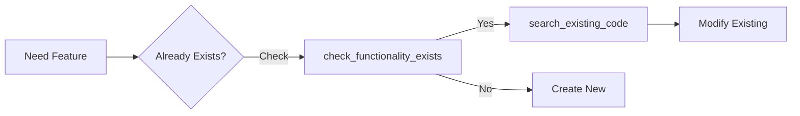
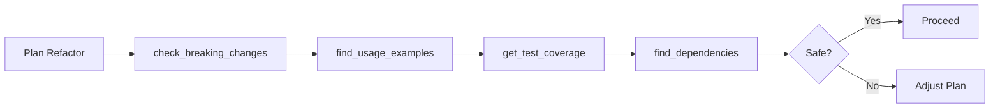

# Tool Reference

Complete documentation for all 20 CodeMind MCP tools.

---

## 🔍 Search & Discovery (4 tools)

### `search_existing_code`
**Purpose**: Semantic search to find existing functionality before creating new files.

**Parameters**:
- `query` (str): Natural language description of what you're looking for
- `workspace_root` (str, optional): Path to workspace (defaults to current directory)
- `limit` (int, optional): Maximum results to return (default: 5)

**Returns**: List of matching files with similarity scores and descriptions.

**Example**:
```python
search_existing_code("JWT authentication", workspace_root="/path/to/project")
```

**Output**:
```
Found 3 relevant files for 'JWT authentication':

1. src/auth/jwt.py (95% match)
   Purpose: JWT token generation and validation for user authentication
   
2. middleware/auth.py (87% match)  
   Purpose: Authentication middleware for protected routes
```

**Use Cases**:
- Before creating new files
- Finding existing implementations
- Discovering related functionality

---

### `check_functionality_exists`
**Purpose**: Quick yes/no check if a feature already exists in the codebase.

**Parameters**:
- `feature_description` (str): Description of the functionality to check
- `workspace_root` (str, optional): Path to workspace
- `confidence_threshold` (float, optional): Minimum confidence (0.0-1.0, default: 0.7)

**Returns**: Boolean + details about where the functionality exists.

**Example**:
```python
check_functionality_exists("user authentication")
```

**Output**:
```
✅ YES - Functionality exists (85% confidence)
Found in: src/auth/jwt.py
Description: JWT token generation and validation
```

**Use Cases**:
- Quick existence checks
- Avoiding duplicate implementations
- Copilot decision-making

---

### `search_by_export`
**Purpose**: Find where specific functions, classes, or variables are defined.

**Parameters**:
- `export_name` (str): Name of function/class/variable to find
- `workspace_root` (str, optional): Path to workspace
- `limit` (int, optional): Maximum results (default: 10)

**Returns**: List of files that export the specified name.

**Example**:
```python
search_by_export("UserModel")
```

**Output**:
```
Found 2 files exporting 'UserModel':

1. models/user.py
   Purpose: User model with password hashing and validation
   Exports: UserModel, validate_password, hash_password

2. models/__init__.py
   Purpose: Model exports for convenience imports
   Exports: UserModel, PostModel, CommentModel
```

**Use Cases**:
- Locating definitions
- Understanding exports
- Import troubleshooting

---

### `get_similar_files`
**Purpose**: Discover files with similar patterns, structure, or purpose.

**Parameters**:
- `file_path` (str): Path to file to find similar files to
- `workspace_root` (str, optional): Path to workspace
- `limit` (int, optional): Maximum results (default: 5)

**Returns**: List of similar files with similarity scores.

**Example**:
```python
get_similar_files("tests/test_user.py")
```

**Output**:
```
Files similar to tests/test_user.py:

1. tests/test_post.py (78% similar)
   Purpose: Test suite for post model CRUD operations

2. tests/test_comment.py (65% similar)
   Purpose: Test suite for comment model
```

**Use Cases**:
- Finding test patterns
- Discovering related modules
- Understanding conventions

---

## 📝 Context & History (4 tools)

### `get_file_context`
**Purpose**: Understand what a file does and why it exists.

**Parameters**:
- `file_path` (str): Path to file to get context for
- `workspace_root` (str, optional): Path to workspace

**Returns**: File purpose, exports, size, last modified, and metadata.

**Example**:
```python
get_file_context("src/utils/helpers.py")
```

**Output**:
```
File: src/utils/helpers.py
Purpose: Utility functions for data validation and formatting
Last scanned: 2025-10-04 10:30:15
Size: 23 KB
Key exports: validate_email, format_date, sanitize_input
```

**Use Cases**:
- Understanding unfamiliar code
- File documentation
- Quick overview

---

### `query_recent_changes`
**Purpose**: See what files have been modified recently.

**Parameters**:
- `workspace_root` (str, optional): Path to workspace
- `hours` (int, optional): How many hours back to look (default: 24)

**Returns**: List of recently changed files with timestamps.

**Example**:
```python
query_recent_changes(hours=48)
```

**Output**:
```
Recent changes in the last 48 hours:

1. src/auth/jwt.py
   Changed: 2 hours ago
   Summary: Added refresh token support

2. models/user.py
   Changed: 5 hours ago
   Summary: Added email verification field
```

**Use Cases**:
- Code review preparation
- Understanding recent work
- Change awareness

---

### `record_decision`
**Purpose**: Store architectural decisions with rationale for future reference.

**Parameters**:
- `description` (str): Brief description of the decision
- `reasoning` (str): Detailed rationale
- `workspace_root` (str, optional): Path to workspace
- `affected_files` (list[str], optional): Files impacted by this decision

**Returns**: Confirmation with decision ID.

**Example**:
```python
record_decision(
  description="Using JWT for authentication",
  reasoning="Chose JWT over sessions for better scalability and mobile support",
  affected_files=["src/auth/jwt.py", "middleware/auth.py"]
)
```

**Output**:
```
✅ Decision recorded (ID: 42)
Affected files: src/auth/jwt.py, middleware/auth.py
```

**Use Cases**:
- Architectural decision records (ADRs)
- Team knowledge sharing
- Context for future changes

---

### `list_all_decisions`
**Purpose**: Query decision history with optional keyword filtering.

**Parameters**:
- `workspace_root` (str, optional): Path to workspace
- `keyword` (str, optional): Filter by keyword
- `limit` (int, optional): Maximum results (default: 10)

**Returns**: List of matching decisions with full details.

**Example**:
```python
list_all_decisions(keyword="authentication")
```

**Output**:
```
Found 3 decisions matching 'authentication':

Decision #12 (2025-01-15 14:30:00):
Description: Using JWT for authentication
Reasoning: Chose JWT over sessions for scalability
Affected files: src/auth/jwt.py, middleware/auth.py

Decision #8 (2025-01-10 09:15:00):
Description: OAuth2 provider integration
Reasoning: Google and GitHub OAuth for easier onboarding
Affected files: src/auth/oauth.py
```

**Use Cases**:
- Understanding past decisions
- Onboarding new developers
- Avoiding repeated discussions

---

## 🔗 Dependencies (3 tools)

### `find_dependencies`
**Purpose**: Bidirectional dependency analysis - what this file imports and what imports it.

**Parameters**:
- `file_path` (str): File to analyze
- `workspace_root` (str, optional): Path to workspace

**Returns**: List of imports and importers.

**Example**:
```python
find_dependencies("src/database.py")
```

**Output**:
```
Dependencies for src/database.py:

IMPORTS (what database.py depends on):
- typing, pathlib, sqlite3, contextlib

IMPORTED BY (what depends on database.py):
- src/models/user.py
- src/models/post.py
- src/auth/session.py
- tests/test_database.py

⚠️ Warning: This file has 4 dependents. Test thoroughly!
```

**Use Cases**:
- Impact analysis before changes
- Understanding module coupling
- Refactoring planning

---

### `get_import_graph`
**Purpose**: Visualize module relationships and detect circular dependencies.

**Parameters**:
- `workspace_root` (str, optional): Path to workspace
- `include_external` (bool, optional): Include external library imports (default: False)

**Returns**: Import graph structure with circular dependency warnings.

**Example**:
```python
get_import_graph()
```

**Output**:
```
Import Graph Summary:
- 45 modules analyzed
- 127 import connections
- 2 circular dependencies detected:
  1. models/user.py → models/post.py → models/user.py
  2. utils/helpers.py → utils/validators.py → utils/helpers.py

Most imported modules:
1. utils/helpers.py (12 imports)
2. models/base.py (8 imports)
```

**Use Cases**:
- Architecture visualization
- Circular dependency detection
- Code organization planning

---

### `get_call_tree`
**Purpose**: Show function call relationships - what it calls and what calls it.

**Parameters**:
- `function_name` (str): Function to analyze
- `workspace_root` (str, optional): Path to workspace
- `file_path` (str, optional): File containing the function
- `depth` (int, optional): Call tree depth (default: 2)

**Returns**: Call tree showing callers and callees.

**Example**:
```python
get_call_tree("authenticate_user", depth=2)
```

**Output**:
```
Call tree for authenticate_user():

CALLS (what it calls):
├─ validate_credentials()
│  └─ check_password_hash()
└─ create_session()
   └─ generate_session_token()

CALLED BY (who calls it):
├─ login_endpoint() [api/auth.py]
└─ refresh_token_endpoint() [api/auth.py]
```

**Use Cases**:
- Understanding execution flow
- Debugging call chains
- Performance analysis

---

## 📊 Code Analysis (2 tools)

### `get_code_metrics_summary`
**Purpose**: Comprehensive code quality metrics - complexity, maintainability, code smells.

**Parameters**:
- `workspace_root` (str, optional): Path to workspace
- `detailed` (bool, optional): Show file-by-file breakdown (default: False)

**Returns**: Project-wide metrics and quality indicators.

**Example**:
```python
get_code_metrics_summary(detailed=True)
```

**Output**:
```
Code Metrics Summary:

PROJECT STATISTICS:
- Total files: 45
- Total lines: 12,543
- Code lines: 9,234 (74%)
- Comment lines: 1,876 (15%)
- Blank lines: 1,433 (11%)

COMPLEXITY:
- Average cyclomatic complexity: 3.2
- High complexity functions: 5
- Functions over 50 lines: 8

MAINTAINABILITY:
- Maintainability index: 72/100 (Good)
- Code smells detected: 12
  - Magic numbers: 5
  - Long parameter lists: 4
  - Deep nesting: 3

RECOMMENDATIONS:
⚠️ Consider refactoring authenticate_user() (complexity: 12)
⚠️ Add docstrings to 23 functions
✅ Good test coverage estimated at 75%
```

**Use Cases**:
- Code quality assessment
- Technical debt tracking
- Code review preparation

---

### `find_configuration_inconsistencies`
**Purpose**: Detect config mismatches across environments and find hardcoded secrets.

**Parameters**:
- `workspace_root` (str, optional): Path to workspace
- `include_examples` (bool, optional): Show example values (default: True)

**Returns**: Configuration analysis with security warnings.

**Example**:
```python
find_configuration_inconsistencies()
```

**Output**:
```
Configuration Analysis:

CONFIGURATION FILES FOUND:
- config/dev.json
- config/prod.json
- .env.example

MISSING VARIABLES:
❌ 'DATABASE_URL' in prod.json (exists in dev.json)
❌ 'SMTP_PASSWORD' in dev.json (exists in prod.json)

HARDCODED SECRETS:
⚠️ config/dev.json:12 - API_KEY = "sk_live_abc123..."
⚠️ src/utils/api.py:45 - SECRET_KEY = "hardcoded_secret"

SECURITY RISKS:
⚠️ DEBUG=true in prod.json (should be false in production)
⚠️ ALLOWED_HOSTS=['*'] too permissive

RECOMMENDATIONS:
1. Move hardcoded secrets to environment variables
2. Set DEBUG=false in production
3. Add missing DATABASE_URL to prod.json
```

**Use Cases**:
- Security audits
- Deployment validation
- Environment consistency

---

## ⚠️ Refactoring Safety (3 tools)

### `check_breaking_changes`
**Purpose**: Identify impacted code before refactoring a function or class.

**Parameters**:
- `function_name` (str): Function/class to analyze
- `file_path` (str): File containing the function
- `workspace_root` (str, optional): Path to workspace

**Returns**: Impact analysis with affected files and severity rating.

**Example**:
```python
check_breaking_changes("UserModel", "models/user.py")
```

**Output**:
```
Breaking Change Analysis for UserModel:

CALL SITES: 7 found

AFFECTED FILES:
1. views/user_views.py (3 usages)
2. api/users.py (2 usages)
3. auth/permissions.py (1 usage)
4. tests/test_user.py (1 usage)

SEVERITY: ⚠️ MODERATE
- Public API: Yes (exported in __init__.py)
- External usage: Likely
- Test coverage: Yes

RECOMMENDATIONS:
1. Update 7 call sites
2. Run tests/test_user.py after changes
3. Consider deprecation warnings for gradual migration
```

**Use Cases**:
- Pre-refactoring impact analysis
- Understanding API usage
- Risk assessment

---

### `find_usage_examples`
**Purpose**: See real-world usage patterns of a function or class.

**Parameters**:
- `function_name` (str): Function/class to find examples for
- `workspace_root` (str, optional): Path to workspace
- `file_path` (str, optional): File containing the function
- `limit` (int, optional): Maximum examples (default: 5)

**Returns**: Real usage examples with surrounding context.

**Example**:
```python
find_usage_examples("APIClient")
```

**Output**:
```
Found 5 usage examples for APIClient:

1. src/services/user_service.py:45
   client = APIClient(base_url=settings.API_URL)
   response = client.get('/users', params={'active': True})
   
2. src/services/post_service.py:23
   with APIClient() as client:
       client.post('/posts', json=post_data)
       
3. tests/test_api.py:67
   mock_client = APIClient(timeout=30)
   mock_client.headers['Authorization'] = 'Bearer token'
```

**Use Cases**:
- Learning API contracts
- Understanding usage patterns
- Documentation generation

---

### `get_test_coverage`
**Purpose**: Estimate test coverage for a file or module.

**Parameters**:
- `file_path` (str): File to check coverage for
- `workspace_root` (str, optional): Path to workspace

**Returns**: Coverage estimate and test file locations.

**Example**:
```python
get_test_coverage("src/auth/jwt.py")
```

**Output**:
```
Test Coverage for src/auth/jwt.py:

ESTIMATED COVERAGE: 75%

TEST FILES:
- tests/test_jwt.py (primary tests)
- tests/test_auth_integration.py (integration tests)

FUNCTIONS TESTED:
✅ generate_token()
✅ validate_token()
✅ refresh_token()
❌ revoke_token() - NO TESTS FOUND

RECOMMENDATIONS:
⚠️ Add tests for revoke_token()
✅ Good coverage overall
```

**Use Cases**:
- Coverage assessment
- Test gap identification
- Quality assurance

---

## 🗂️ Management (4 tools)

### `force_reindex`
**Purpose**: Manually trigger full project re-scan and rebuild index.

**Parameters**:
- `workspace_root` (str, optional): Path to workspace

**Returns**: Indexing summary with file counts.

**Example**:
```python
force_reindex()
```

**Output**:
```
🔄 Full reindex started...

PROGRESS:
- Scanned: 156 files
- Indexed: 142 files
- Skipped: 14 files (too large or binary)
- Duration: 12.3 seconds

✅ Reindex complete!
```

**Use Cases**:
- After major changes
- Database corruption recovery
- Fresh index needed

---

### `index_file`
**Purpose**: Index a specific file immediately (useful for new files).

**Parameters**:
- `file_path` (str): File to index
- `workspace_root` (str, optional): Path to workspace

**Returns**: Confirmation with file details.

**Example**:
```python
index_file("src/new_feature.py")
```

**Output**:
```
✅ File indexed: src/new_feature.py
Purpose: New feature for user notifications
Size: 3.2 KB
Exports: NotificationService, send_notification
```

**Use Cases**:
- Immediate indexing of new files
- Manual index updates
- Testing indexing

---

### `find_todo_and_fixme`
**Purpose**: Track technical debt (TODO/FIXME/HACK/XXX comments).

**Parameters**:
- `workspace_root` (str, optional): Path to workspace
- `tag_type` (str, optional): Type of tag (TODO/FIXME/HACK/XXX, default: "TODO")
- `search_term` (str, optional): Filter by keyword
- `limit` (int, optional): Maximum results (default: 20)

**Returns**: List of matching comments with context.

**Example**:
```python
find_todo_and_fixme(tag_type="FIXME")
```

**Output**:
```
Found 8 FIXME comments:

1. src/auth/jwt.py:67
   # FIXME: Handle expired token edge case
   def validate_token(token):

2. models/user.py:123
   # FIXME: Add email validation before saving
   def save(self):

3. utils/cache.py:45
   # FIXME: Memory leak when cache grows too large
   cache[key] = value
```

**Use Cases**:
- Technical debt tracking
- Sprint planning
- Code cleanup

---

### `get_file_history_summary`
**Purpose**: Analyze git commit history for a file - who changes it and how often.

**Parameters**:
- `file_path` (str): File to analyze
- `workspace_root` (str, optional): Path to workspace
- `days_back` (int, optional): Days of history (default: 90)

**Returns**: Commit history with contributors and change frequency.

**Example**:
```python
get_file_history_summary("src/database.py", days_back=30)
```

**Output**:
```
Git History for src/database.py (last 30 days):

ACTIVITY:
- Total commits: 15
- Contributors: 3
- Last modified: 2 days ago
- Change frequency: High (5 commits/week)

TOP CONTRIBUTORS:
1. Alice (60% of changes)
2. Bob (30% of changes)
3. Charlie (10% of changes)

RECENT COMMITS:
- 2 days ago: "Add connection pooling"
- 5 days ago: "Fix transaction handling"
- 8 days ago: "Optimize query performance"

RISK RATING: ⚠️ MODERATE
(Frequently changed files are more likely to have issues)
```

**Use Cases**:
- Identifying code experts
- Understanding change patterns
- Risk assessment

---

## Tool Usage Patterns

### Discovery Workflow


### Refactoring Workflow


### Code Review Workflow


---

## Multi-Workspace Usage

All tools accept an optional `workspace_root` parameter:

```python
# Work with different projects
search_existing_code("auth", workspace_root="/project-a")
search_existing_code("auth", workspace_root="/project-b")

# Each workspace maintains isolated data
record_decision("Use Redis", workspace_root="/project-a")  # Only in project A
record_decision("Use Memcached", workspace_root="/project-b")  # Only in project B
```

---

## Performance Characteristics

| Tool | Typical Speed | Resource Usage |
|------|---------------|----------------|
| `search_existing_code` | <500ms | Low (uses embeddings) |
| `check_functionality_exists` | <300ms | Low |
| `find_dependencies` | <200ms | Low (uses AST cache) |
| `get_import_graph` | 1-3s | Medium (full analysis) |
| `get_code_metrics_summary` | 2-5s | Medium (AST + metrics) |
| `force_reindex` | 10-30s | High (full scan) |

---

## Best Practices

### 1. Use Semantic Search First
Before creating new files, always search for existing functionality:
```python
search_existing_code("what I need")  # Find existing
check_functionality_exists("feature")  # Quick check
```

### 2. Record Important Decisions
Track architectural decisions for future reference:
```python
record_decision(
    description="Choice made",
    reasoning="Why we chose this",
    affected_files=["list", "of", "files"]
)
```

### 3. Check Impact Before Refactoring
Always analyze breaking changes first:
```python
check_breaking_changes("function_name", "file.py")
find_usage_examples("function_name")
get_test_coverage("file.py")
```

### 4. Monitor Technical Debt
Regularly check for TODOs and code quality:
```python
find_todo_and_fixme(tag_type="FIXME")
get_code_metrics_summary(detailed=True)
```

### 5. Understand Dependencies
Know what depends on what:
```python
find_dependencies("important_file.py")
get_import_graph()  # Visualize entire project
```

---

For more examples, see **[Examples Guide](EXAMPLES.md)**.
